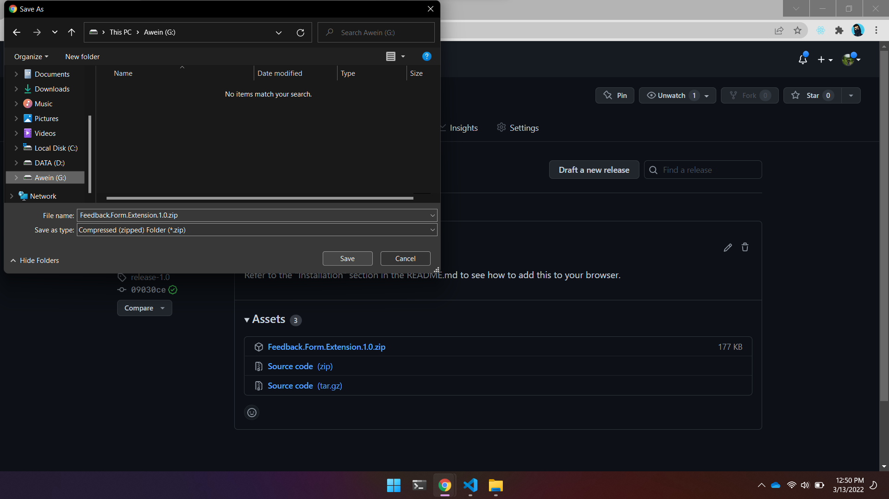
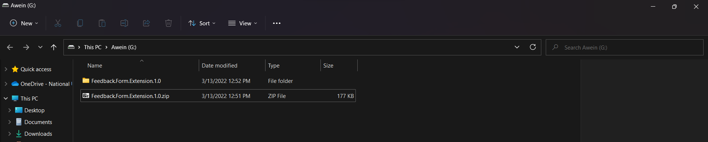
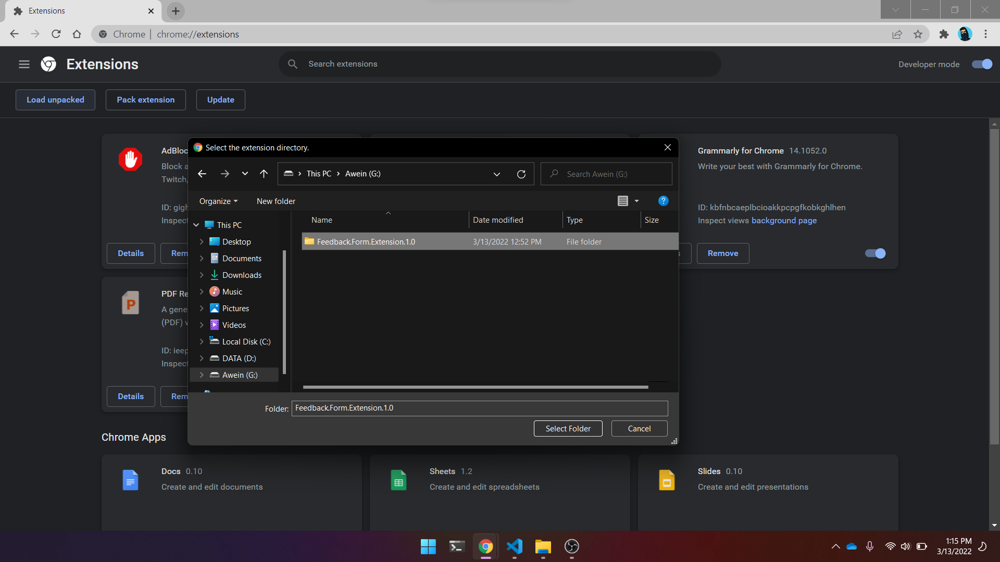
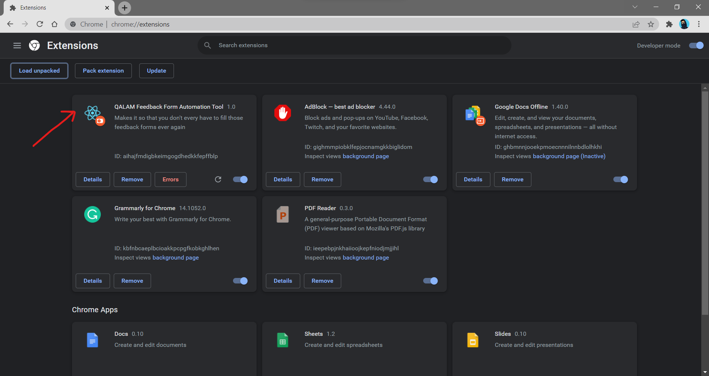
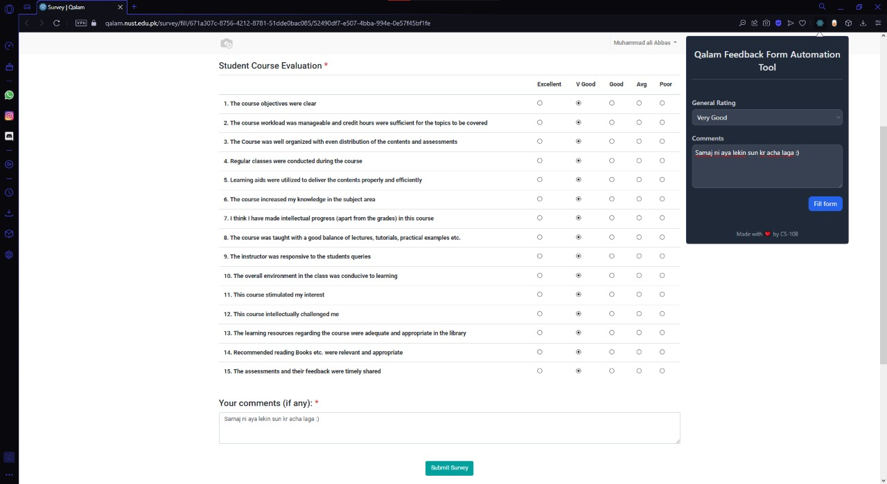
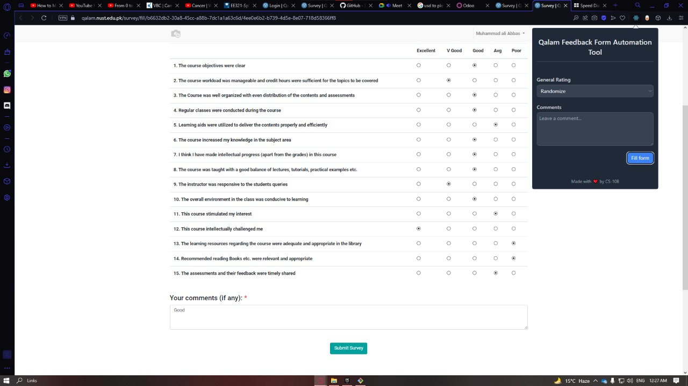
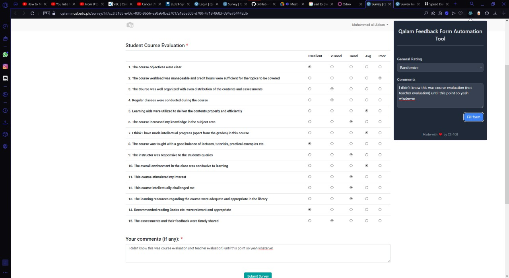
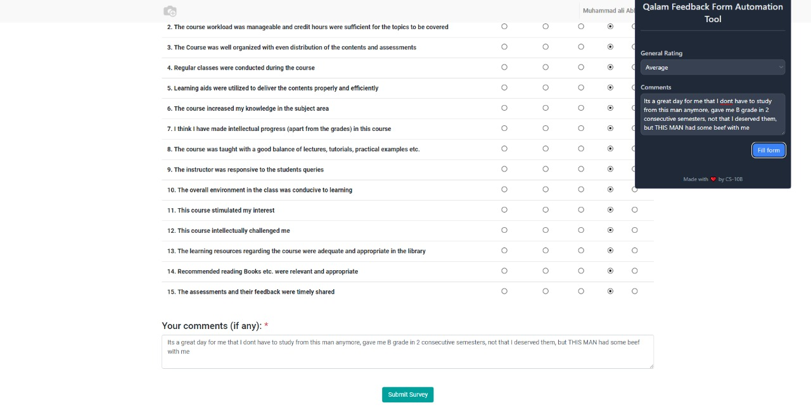

# QALAM Feedback Extension 

<!--  -->
<!--  -->

## Contents
  - [Extension Support](#extension-support)
  - [Installation](#installation)
  - [Usage](#usage)
  - [License](#license)
  - [Issues, Bugs Reports, and Suggestions](#issues-bugs-reports-and-suggestions)

___ 

## Extension Support
The extension works on all chromium based browsers, but it's recommended to be used with chrome since the extension is not tested adequately on other browsers. 
Some of the popular chromium based browsers include Chrome, Brave, Edge, Opera, Vivaldi, and Yandex  

## Installation 
To add the the extension to your browser you can follow the steps listed below, 
*Note: This is a one-time step.* 
 1. Download the latest [release](https://github.com/ShaderOX/nust-feeback-ext/releases) (*`Feedback.Form.Extension.1.0.zip`*) from the GitHub page. 
  
 1. Unzip the file
  
    1. Then head over to the extensions tab on your browser, for chrome its [chrome://extensions](chrome://extensions)
    1. Then enable `Developer mode` 
    
    1. Then click on `Add Unpacked`
    
1. Then simple select that extracted folder from the step 2 and it should appear in the list of extensions. 

 

## Usage
The extension is designed to work only on the Qalam Feedback form page and no other page. 
Some screenshots are attached below to help you get started. 

*Images courtesy of [Ali Abbas](https://github.com/abbassays)*

## License
You can read the license [here](./LICENSE)

## Issues, Bugs Reports, and Suggestions 
This was just a fun project and it definitely needs improvement and a lot of work. 
In case you find an error or have a suggestion, please feel free to open an issue or make a pull request. 
Enjoy :) 
